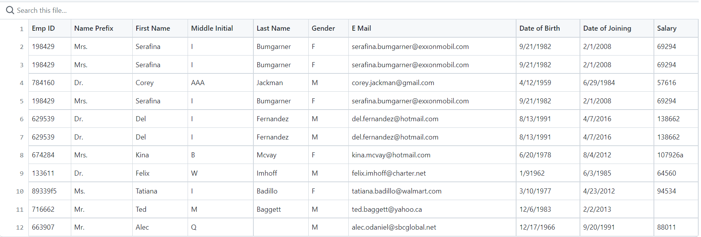
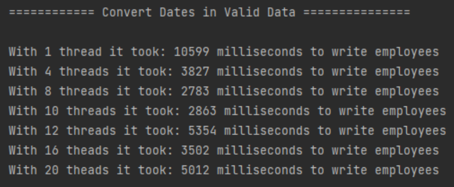

# Employee CSV Date Migration Project

#### Developed by Aiden Sykes, Antony Ademefun, Monali Dhamale and Piotr Sulek


### Table Of Contents

<!-- TABLE OF CONTENTS -->
<details>
  <summary>Table of Contents</summary>
  <ol>
    <li>
      <a href="#about-the-project">About The Project</a>
      <ul>
        <li><a href="#built-with">Built With</a></li>
      </ul>
    </li>
    <li>
      <a href="#getting-started">Getting Started</a>
      <ul>
        <li><a href="#prerequisites">Prerequisites</a></li>
        <li><a href="#installation">Installation</a></li>
      </ul>
    </li>
    <li><a href="#tour">Project Tour</a></li>
    <li><a href="#development">Development</a></li>
    <li><a href="#contact">Contact</a></li>
    <li><a href="#acknowledgments">Acknowledgments</a></li>
  </ol>
</details>

### About the Project

This project has been developed as a team of four during the span of a week. We split our workload and co-ordinated our meetings by the use of agile methodology.


The project's functionality includes being able to read, validate and write CSV Files to databases.


<p align="right">(<a href="#top">back to top</a>)</p>

### Built With

* [IntelliJ Community Edition](https://www.jetbrains.com/idea/)
* [GitHub Desktop](https://desktop.github.com)
* [junit-jupiter:5.8.2](https://junit.org/junit5/docs/current/user-guide/)
* MySQL

### Dependencies

* junit.jupiter Version 5.8.2
* apache.logging.log4j Version 2.17.1


<p align="right">(<a href="#top">back to top</a>)</p>


## Getting Started

Simply run this project using IntelliJ Community Edition. Make sure to install the dependencies and implementations listead above.

### Installation

1. Clone the repository below.
   ```sh
   git clone https://github.com/piotr02/Employee-CSV-Data-Migration-Project.git
   ```
2. Either import or run the downloaded file onto IntelliJ Community Edition.


<p align="right">(<a href="#top">back to top</a>)</p>


### Project Tour

* Phase 1 : We Created Employee-CSV-Data-Migration-Project and write code to read data from an Employee CSV file.Corrupt or duplicated data and records with missing fields,              added to a separate collection for analysis i.e TestCorruptedData.csv,TestDuplicatedData.csv files and TestMissingValuesData.csv file and testes the files with the            help JUnit.
* Duplicate Data
             
 * Missing Values
              
 * CorruptData
               
 * Duplicate Data
                
             
* Phase 2 : Used MySQL Database and create a connection and transefering dates from JAVA to SQL. 
* Create database  from JAVA to Mysql

* Create Database
              
              
* comparing the execution time 
 

* Phase 3 : Implementing multiple threads to write the data and comparing the execution time. 
* Create Database From Java To SQL
 
* Phase 4 : Modified code to make use of functional programming concepts – lambdas and streams.


## Technologies:

Project is created with:
* IntelliJ IDEA 2021.3.1
* junit-jupiter:5.8.2
* apache.logging.log4j:2.17.1
* Java for IntelliJ
* GitHub Desktop
* GitHub
* MySQL

<!-- ACKNOWLEDGMENTS -->
## Acknowledgments

Thank you to the Training Staff at Sparta Global for teaching and assisting me during the development of my project.

* [Nishant Mandal]()
* [Paula Kendra]()
* [Neil Weightman]()

<p align="right">(<a href="#top">back to top</a>)</p>